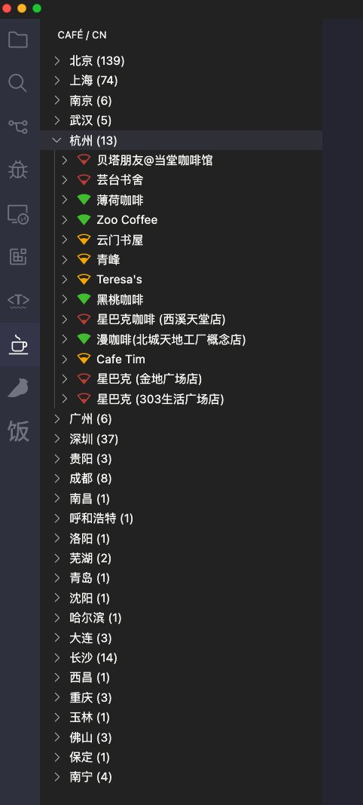

VSCode Extension for <a href='https://github.com/ElaWorkshop/awesome-cn-cafe'>Awesome CN Café</a>

 

## Related

- [awesome-cn-cafe](https://github.com/ElaWorkshop/awesome-cn-cafe) - A curated list of awesome coffee places for work in China.
- [awesome-cn-cafe-web](https://github.com/antfu/awesome-cn-cafe-web) - ☕️ Web App for Awesome CN Café

## License

MIT License © 2022 [YRM](https://github.com/yrming)
